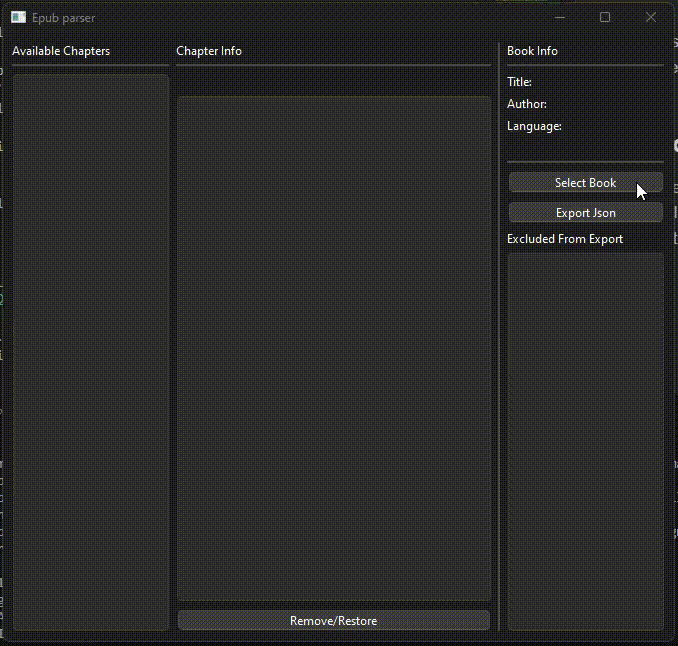

# Simple Python ePUB parsing tool

This is a simple Python app that allows you to extract desired chapters from epub and export them as Json. The app uses the `PyQt6` module for its GUI and python 3.10.0 or higher.

### How to install
- Clone this repository 
- Install dependencies by running `pip install -r requirements.txt`
- Run the main file by running `python main.py`

### Demo


### Json structure
```
{
    "chapter_name": "Chapter_content",
    "another_chapter":"another chapter content"
}
```